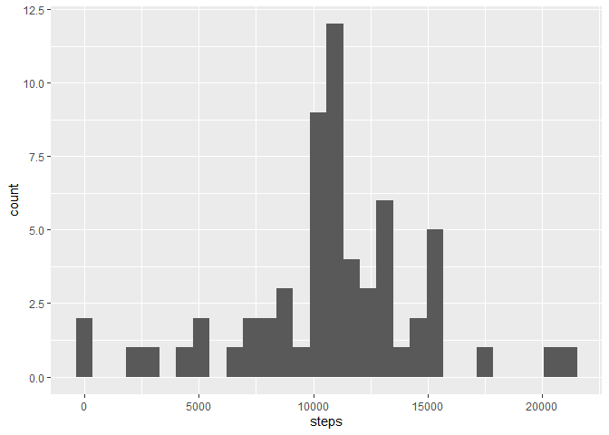

## Loading and preprocessing the data


``` r
library(tidyverse)
```

```
## ── Attaching core tidyverse packages ──────────────────────── tidyverse 2.0.0 ──
## ✔ dplyr     1.1.4     ✔ readr     2.1.5
## ✔ forcats   1.0.0     ✔ stringr   1.5.1
## ✔ ggplot2   3.5.2     ✔ tibble    3.3.0
## ✔ lubridate 1.9.4     ✔ tidyr     1.3.1
## ✔ purrr     1.1.0     
## ── Conflicts ────────────────────────────────────────── tidyverse_conflicts() ──
## ✖ dplyr::filter() masks stats::filter()
## ✖ dplyr::lag()    masks stats::lag()
## ℹ Use the conflicted package (<http://conflicted.r-lib.org/>) to force all conflicts to become errors
```

``` r
unzip('activity.zip')
activity <- read_csv('activity.csv')
```

```
## Rows: 17568 Columns: 3
## ── Column specification ────────────────────────────────────────────────────────
## Delimiter: ","
## dbl  (2): steps, interval
## date (1): date
## 
## ℹ Use `spec()` to retrieve the full column specification for this data.
## ℹ Specify the column types or set `show_col_types = FALSE` to quiet this message.
```

## What is mean total number of steps taken per day?


``` r
filled <- activity[!is.na(activity$steps),]
stepsperday <- aggregate(steps ~ date, data=filled, sum)
g1 <- ggplot(data=stepsperday, aes(x=steps))
g1 + geom_histogram()
```

```
## `stat_bin()` using `bins = 30`. Pick better value with `binwidth`.
```

<!-- -->

``` r
mean(stepsperday$steps)
```

```
## [1] 10766.19
```

``` r
median(stepsperday$steps)
```

```
## [1] 10765
```

## What is the average daily activity pattern?


``` r
stepsperint <- aggregate(steps ~ interval, data=filled, mean)
plot(stepsperint$interval, stepsperint$steps, type='l')
```

<!-- -->

``` r
stepsperint$interval[which.max(stepsperint$steps)]
```

```
## [1] 835
```

## Imputing missing values


``` r
sum(is.na(activity$steps))
```

```
## [1] 2304
```

``` r
# We will replace all NA's with the mean value for that interval
complete <- activity %>% 
	left_join(stepsperint, by='interval', suffix=c('','_mean')) %>% 
	mutate(steps=ifelse(is.na(steps), steps_mean, steps)) %>% 
	select(-steps_mean)
completestepsperday <- aggregate(steps ~ date, data=complete, sum)
g2 <- ggplot(data=completestepsperday, aes(x=steps))
g2 + geom_histogram()
```

```
## `stat_bin()` using `bins = 30`. Pick better value with `binwidth`.
```

<!-- -->

``` r
mean(completestepsperday$steps)
```

```
## [1] 10766.19
```

``` r
median(completestepsperday$steps)
```

```
## [1] 10766.19
```

## Are there differences in activity patterns between weekdays and weekends?


``` r
byday <- complete %>% mutate(day=ifelse(weekdays(date) %in% 
	c('Saturday', 'Sunday'), 'weekend', 'weekday'))
completestepsperintday <- aggregate(steps ~ interval + day, data=byday, mean)
g3 <- ggplot(data=completestepsperintday, aes(interval, steps))
g3 + facet_wrap(.~day, nrow=2) + geom_line()
```

<!-- -->
